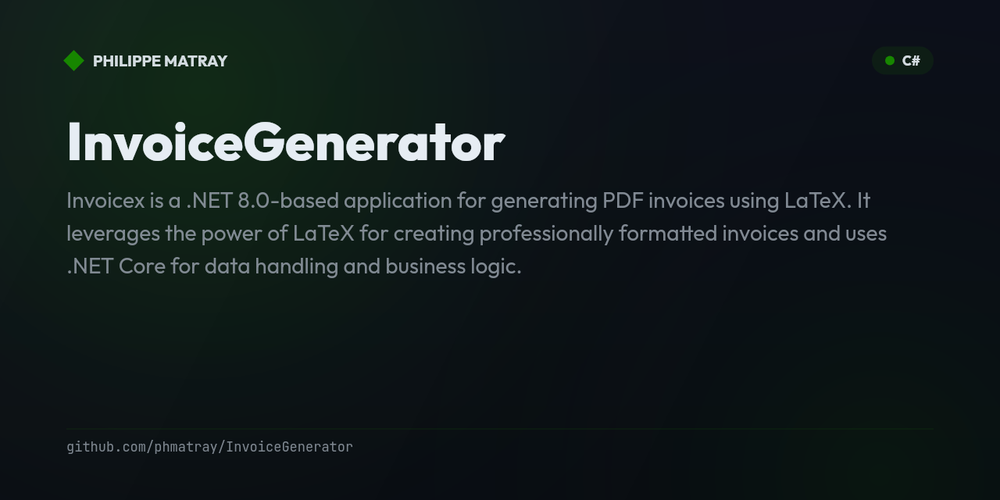

# Invoicex

<!-- portfolio-badges:start -->
<!-- Identity -->
[](https://github.com/phmatray/InvoiceGenerator)

[](https://github.com/phmatray/InvoiceGenerator/stargazers)
[](https://github.com/phmatray/InvoiceGenerator/network/members)
[](https://github.com/phmatray/InvoiceGenerator/blob/HEAD/LICENSE)

<!-- Activity -->
[](https://github.com/phmatray/InvoiceGenerator/issues)
[](https://github.com/phmatray/InvoiceGenerator/pulls)
[](https://github.com/phmatray/InvoiceGenerator/commits)
<!-- portfolio-badges:end -->


Invoicex is a .NET 8.0-based application for generating PDF invoices using LaTeX. It leverages the power of LaTeX for creating professionally formatted invoices and uses .NET Core for data handling and business logic.

## Table of Contents

- [Features](#features)
- [Requirements](#requirements)
- [Installation](#installation)
- [Running the Project](#running-the-project)
- [Docker Setup](#docker-setup)
  - [Building the Docker Image](#building-the-docker-image)
  - [Running the Docker Container](#running-the-docker-container)
- [Configuration](#configuration)
- [Contributing](#contributing)
- [License](#license)

## Features

- Generate PDF invoices from data using LaTeX templates.
- Dependency injection for flexibility and testability.
- LaTeX compilation integrated using `pdflatex`.
- Dockerized for easy deployment with LaTeX and .NET 8.0 support.
- Customizable invoice templates with dynamic data insertion.

## Requirements

- .NET 8.0 SDK
- LaTeX (TeX Live distribution)
- Docker (optional for containerization)
- Linux, macOS, or Windows

## Installation

### Prerequisites

- Install the .NET 8.0 SDK from the official [.NET website](https://dotnet.microsoft.com/download/dotnet/8.0).
- Install TeX Live (for LaTeX) on your system:
  - **Linux**: Run `sudo apt-get install texlive-full`
  - **macOS**: Use MacTeX or install via `brew cask install mactex`.
  - **Windows**: Use a LaTeX distribution like MikTeX or TeX Live.

### Clone the repository

```bash
git clone https://github.com/phmatray/Invoicex.git
cd Invoicex
```

### Install Dependencies

```bash
dotnet restore
```

### Configuration

Modify the `appsettings.json` file to specify directories for templates and output, and provide the path to the LaTeX executable (`pdflatex`).

```json
{
  "LaTeXSettings": {
    "TemplateDirectory": "Templates",
    "OutputDirectory": "../../Output",
    "PdfLaTeXPath": "/path/to/pdflatex"
  }
}
```

### Running the Project

You can run the project using the .NET CLI:

```bash
dotnet run
```

This will generate the invoice and compile the LaTeX into a PDF, which will be placed in the output directory specified in `appsettings.json`.

## Docker Setup

To run this project in a Docker container with LaTeX support, you can build a Docker image and run it in a container.

### Building the Docker Image

Make sure you have Docker installed. Then build the Docker image using the following command:

```bash
docker build -t invoicex .
```

### Running the Docker Container

After building the image, you can run the container:

```bash
docker run -p 5000:5000 invoicex
```

This command will expose the application on port 5000.

## Configuration

In the `appsettings.json` file, you can configure:

- **TemplateDirectory**: The directory where LaTeX invoice templates are stored.
- **OutputDirectory**: The directory where generated PDFs will be saved.
- **PdfLaTeXPath**: The path to the `pdflatex` executable for compiling LaTeX files.

Example `appsettings.json`:

```json
{
  "LaTeXSettings": {
    "TemplateDirectory": "Templates",
    "OutputDirectory": "../../Output",
    "PdfLaTeXPath": "/Library/TeX/texbin/pdflatex"
  }
}
```

<!-- portfolio-techstack:start -->

## Tech Stack

- **.NET 10**
- Bogus
- Microsoft.Extensions.Configuration
- Microsoft.Extensions.DependencyInjection
- Microsoft.Extensions.Hosting

<!-- portfolio-techstack:end -->

<!-- portfolio-roadmap:start -->

## Roadmap

Planned work and known limitations are tracked in the [open issues](https://github.com/phmatray/InvoiceGenerator/issues). Contributions toward them are welcome.

<!-- portfolio-roadmap:end -->

## Contributing

Contributions are welcome! Please follow these steps to contribute:

1. Fork the repository.
2. Create a new branch (`git checkout -b feature-branch`).
3. Make your changes and commit them (`git commit -m 'Add some feature'`).
4. Push to the branch (`git push origin feature-branch`).
5. Create a new Pull Request.

## License

This project is licensed under the MIT License - see the [LICENSE](LICENSE) file for details.

<!-- portfolio-nugetkeep:start -->
---
Built by [Atypical Consulting](https://www.atypical.consulting). We also make
[NuGetKeep](https://nugetkeep.com/?utm_source=github-readme&utm_medium=readme&utm_campaign=launch-2026-07),
a self-hosted NuGet server with supply-chain quarantine.
<!-- portfolio-nugetkeep:end -->
